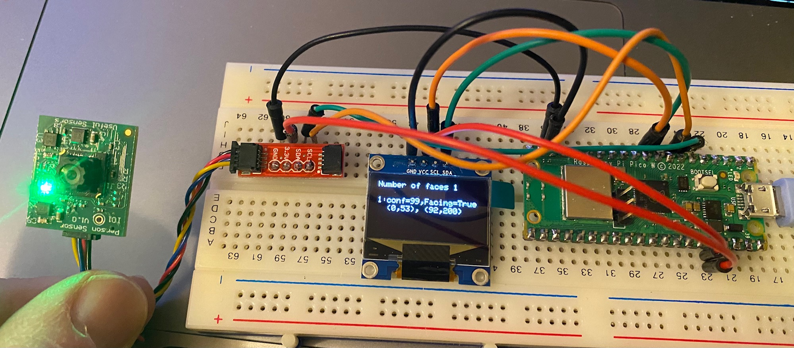

# PicoPersonSensor
Simple code for displaying output from PersonSensor to oled device on a Raspberry Pi Pico

This code is derived from the example at https://github.com/usefulsensors/person_sensor_circuit_python. 
The only substantial difference is that it is writing to an OLED display

The purpose of this project is simpy to understand the [PersonSensor](https://usefulsensors.com/person-sensor/) 
and the Pico. 
